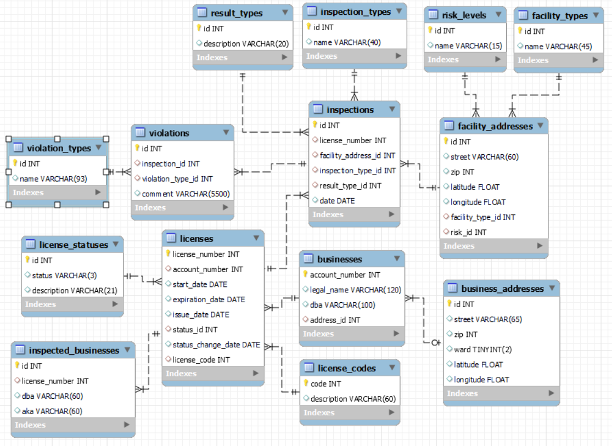
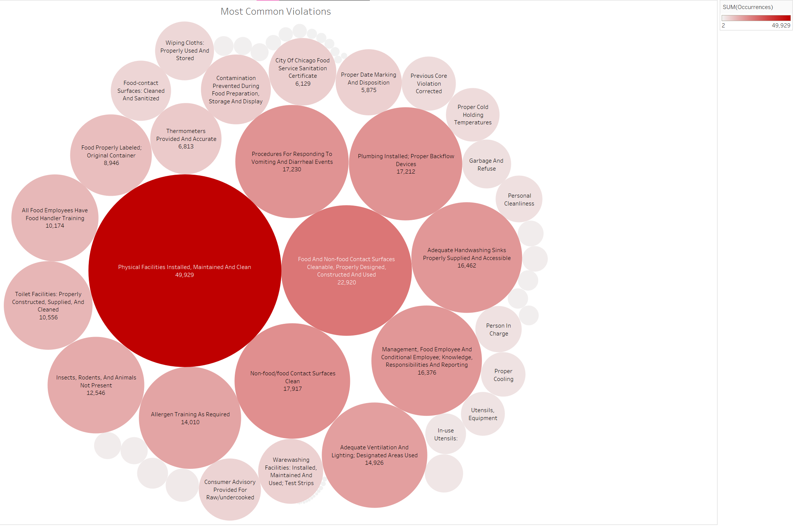

# UChicago Data Engineering Final Project

### **Prompt**
Process, normalize, and analyze one or both of the given Chicago datasets: 
- [Business Licenses](https://data.cityofchicago.org/Community-Economic-Development/Business-Licenses/r5kz-chrr)
- [Food Inspections](https://data.cityofchicago.org/Health-Human-Services/Food-Inspections-7-1-2018-Present/qizy-d2wf)

I chose to use both to examine food inspections by city ward. 
In this context, the business licenses dataset was largely only needed to determine ward number information for an inspected business. 
The food inspections dataset does not include ward numbers, but does include the business's license number. 
This relation was used to determine the ward number for a given food inspection.

### **Setup**
##### Required Programs
- Python 3.10+
- MySQL

Both Python3 and MySQL executables should be in your environment's PATH.

##### Optional Programs
- MySQL Workbench
- MongoDB
- MongoDB Shell
- Tableau
- Tableau MySQL Connector (Tableau will prompt to install this if it isn't present)
- Git

##### Post Program Installation Steps
1.  - If `Git` is installed, clone this repo with  `git clone https://github.com/matt-manes/uchicago_dataeng_finalproject`
    - If `Git` is not installed, manually clone this repo by:
        1. Clicking the '<> Code' button in the upper right side of the repo's GitHub page
        2. Clicking 'Download ZIP' from the drop down menu
        3. Extracting the contents from the downloaded ZIP

2. Open a terminal and navigate to this repo
3. Execute the command `pip install -r requirements.txt`

### **Pipeline Development**
The first step was writing the `pull_data.py` script. 
This simply downloads the most recent uploads of the two datasets and writes them to respective `.csv` files.

While this project primarily uses SQL databases, the initial exploration was done with MongoDB to avoid defining any schemas before becoming familiar with the data. 
The data was loaded by running the `csv_to_mongo.py` script with queries performed ad hoc in the MongoDB shell.

After this stage, I began prototyping my normalization plan using SQLite as well as implementing and refining the data processing and cleaning steps. 
The SQLite table definitions can be found in `chidata_ddl_sqlite.sql`. 

The bulk of the coding in this project was done to clean and normalize the data using Pandas and is located in the `dataloader.py` file. 
Executing this file will will create a SQLite database called `chi.db`, execute the `chidata_ddl_sqlite.sql` script, then process the data and load it into the database.

Once the table plan was determined, MySQL Workbench was used to create a data model (`chidata_model.mwb`) that implements the MySQL iteration of the normalized table schema, 
to produce an Enhanced Entity Relation (E.E.R.) diagram, and to generate the `chidata_ddl_mysql.sql` file that contains the SQL commands for creating the schema. 
This file can be run from either MySQL Workbench or MySQL shell to create the database and instantiate the tables.

The final schema is represented in the following E.E.R. diagram:

Now the `chibased.py` file can be executed to generate a file named `chidata_dml_mysql.sql` that contains all the MySQL data insertion commands for the database and corresponds to the tables defined in `chidata_ddl_mysql.sql`. 
This file tends to be rather large so it's recommended to run it from the MySQL shell rather than trying to open it in MySQL Workbench. 
Once the MySQL database is populated, a third script named `mysql_views.sql` can be run to produce a number of views. 
Running this script is really only neccessary in order to open the `chidata.twb` file in Tableau. 
All three of these SQL scripts (`chidata_ddl_mysql.sql`, `chidata_dml_mysql.sql`, and `mysql_views.sql`) can be run in sequence by executing the `mysql_executor.py` file.

### **Pipeline Automation**
The entire pipeline is automated in the file `pipeline.py` and requires no user interaction beyond entering MySQL credentials when prompted.
Executing `pipeline.py` performs the following workflow:
1. The current versions of both datasets are downloaded to local `.csv` files.
2. The SQLite database is created according to `chidata_ddl_sqlite.sql`.
3. The data from the `.csv` files is loaded, processed, and inserted into the SQLite database (`chidata.db`).
4. The `chidata_dml_mysql.sql` file is generated from the SQLite database.
5. The `chidata_ddl_mysql.sql` script is executed creating the MySQL schema.
6. The `chidata_dml_mysql.sql` script is executed and populates the MySQL database.
7. The `mysql_views.sql` script is executed and creates a number of helpful views.

### **Analysis/Visualizations**
I was primarily interested in looking at how aspects of food inspections were distributed by city ward. 
Obviously, one would expect a ward with more businesses to have correspondingly higher food inspection statistics so I found it more relevant to look at the numbers as ratios to the number of businesses in a ward. 
Since nearly all the analysis views in `mysql_views.sql` are based on this, I implemented the number of business per ward as its own at the start of the script as follows:
<pre>
CREATE OR REPLACE VIEW
    num_inspected_businesses_by_ward AS
SELECT
    COUNT(*) AS num_businesses,
    business_addresses.ward
FROM
    inspected_businesses
    INNER JOIN licenses ON inspected_businesses.license_number = licenses.license_number
    INNER JOIN businesses ON licenses.account_number = businesses.account_number
    INNER JOIN business_addresses ON businesses.address_id = business_addresses.id
GROUP BY
    business_addresses.ward;
</pre>
The remainder of `mysql_views.sql` creates views for:
* Ratio of inspections to number of businesses per ward
* Ratio of inspection results to number of businesses per ward
* Ratio of failed inspections to number of businesses per ward
* Ratio of passed inspections to number of businesses per ward
* The number of occurences of each violation type irrespective of ward
* Ratio of violation type occurence to number of businesses per ward
* Ratio of violations to number of businesses per ward
* Ratio of inspection types to number of businesses per ward
* Ratio of canvass inspections to number of businesses per ward
* Ratio of inspections instigated by complaints to number of businesses per ward
* Ratio of passed to failed inspections by ward

The following visualization were created in Tableau using the MySQL database and created views:

